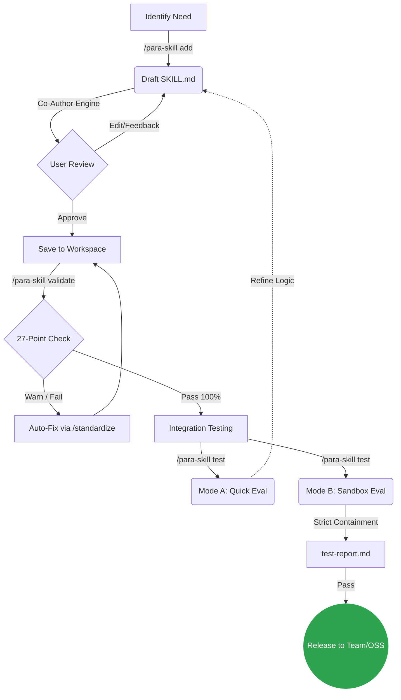

<div align="center">
  
  <h1>para-skills 🧠</h1>
  <p><b>Curated AI Agent skills and the <code>/para-skill</code> workflow for PARA Workspace.</b></p>
  
  <p>
    <a href="README.md"><b>🇺🇸 English</b></a> •
    <a href="docs/locales/vi.md"><b>🇻🇳 Tiếng Việt</b></a> •
    <a href="docs/locales/zh-CN.md"><b>🇨🇳 中文</b></a>
  </p>

  <p>
    <a href="LICENSE"></a>
  </p>
</div>

<br/>

## Table of Contents

- [Overview](#overview)
- [Documentation](#documentation)
- [Quick Start](#quick-start)
- [What's Included](#whats-included)
- [The Skill Lifecycle](#the-skill-lifecycle)
- [Workflow Actions](#workflow-actions)
- [Skill Templates](#skill-templates)
- [Quality Checklist (27 Points)](#quality-checklist-27-points)
- [Contributing](#contributing)
- [License](#license)

## Overview

**para-skills** provides:

1. **`/para-skill` workflow** — A Co-Author engine that guides you through creating, validating, and testing AI Agent skills
2. **Skill templates** — Ready-to-use templates for common skill types (project-profile, tool/utility)
3. **Quality checklist** — A 27-point framework (including Sandbox Testing) for ensuring skill quality

## 📖 Documentation

- [**Skill Development Guide**](docs/skill-development-guide.md) — How to create, validate, and Sandbox test a skill.
- [**Architecture**](docs/architecture.md) — System overview, content zoning, and data flow.

## 🚀 Quick Start

### Install the workflow

Copy the workflow into your PARA Workspace:

```bash
# From your PARA workspace root
cp skills/para-skill/para-skill.md .agents/workflows/para-skill.md
```

### Create your first skill

```bash
# Create a project-profile skill for your project
/para-skill add project-profile --template project

# Or create a utility skill
/para-skill add my-tool --template tool
```

### Validate & test

```bash
# Check quality compliance
/para-skill validate project-profile

# Run conversational evaluation
/para-skill test project-profile
```

## 📦 What's Included

```
skills/
├── catalog.yml                    # Skill registry
└── para-skill/
    ├── para-skill.md              # The workflow (6 actions)
    └── references/
        ├── skill-quality-checklist.md   # 27-point quality framework
        └── templates/
            ├── project-profile.md  # Project DNA template
            └── tool-skill.md       # Utility/automation template
```

## 🔄 The Skill Lifecycle

Developing an AI Agent skill requires discipline to ensure it doesn't cause hallucination or execute destructive actions. The `/para-skill` workflow enforces this lifecycle:



## 🛠 Workflow Actions

| Action        | Description                                             |
| :------------ | :------------------------------------------------------ |
| `list`        | Compare active skills vs. governed catalog              |
| `add`         | Create a new skill via guided Co-Author interview       |
| `install`     | Install or update a skill from the governed catalog     |
| `validate`    | Check a skill for PARA + quality compliance (read-only) |
| `standardize` | Upgrade an existing skill to current standards          |
| `test`        | Run conversational eval with user-provided test prompts |

## 📋 Skill Templates

### 🏗️ Project Profile (`--template project`)

Creates a **project DNA** skill covering:

- §1. Project Identity (type, language, build system)
- §2. Naming Conventions (plans, branches, commits)
- §3. Maintenance Patterns (version bump, dogfooding)
- §4. Quality Standards (build/test commands)
- §5. Documentation Flow (internal vs public)
- §6. Plan Review Checklist (the most powerful section — catches planning mistakes)

### 🔧 Tool Skill (`--template tool`)

Creates a **utility/automation** skill with:

- Workflow steps in imperative form
- Input/Output format specification
- Edge case handling
- Script and reference bundling

## 🔍 Quality Checklist (27 Points)

| Group   | Points         | What it checks                                         |
| :------ | :------------- | :----------------------------------------------------- |
| P1-P5   | PARA Structure | Frontmatter, folder, index, naming, version            |
| D1-D4   | Description    | Trigger context, pushy, length, specificity            |
| C1-C4   | Content        | Length, progressive disclosure, references, TOC        |
| W1-W5   | Writing Style  | Explain why, imperative, examples, scope, safety       |
| B1-B3   | Resources      | Scripts, references, assets organization               |
| T1-T3   | Test Readiness | Test prompts, expected output, testability type        |
| TM1-TM3 | Test Mode      | Sandbox overrides, containment paths, report templates |

## 🤝 Contributing

See [CONTRIBUTING.md](CONTRIBUTING.md) for guidelines.

## 📄 License

[MIT License](LICENSE)

---

Built for the [PARA Workspace](https://github.com/pageel/para-workspace) ecosystem.
